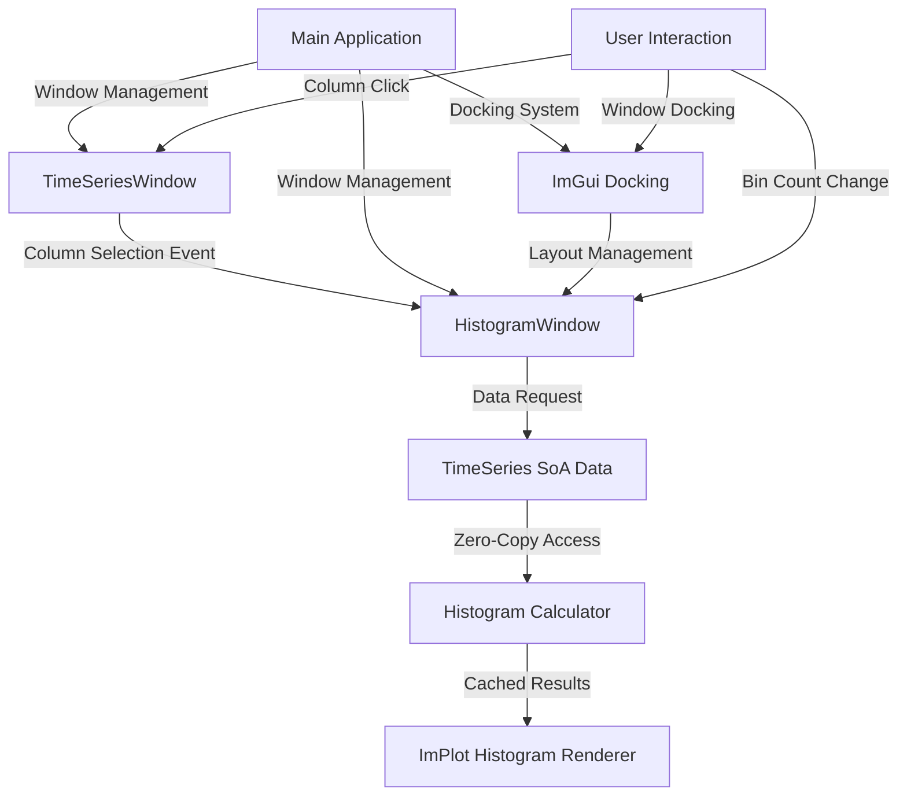
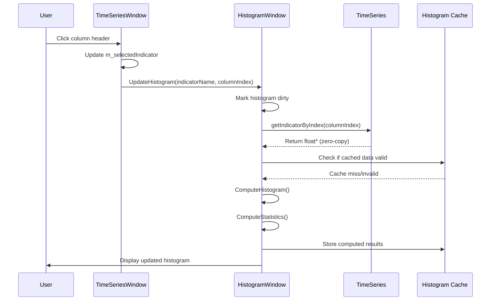

# HistogramWindow Design Specification

## Overview

The HistogramWindow is a dockable panel that displays statistical distribution histograms for selected time series indicators. It integrates seamlessly with the existing TimeSeriesWindow architecture, leveraging the efficient SoA data structure and following established ImGui UI patterns. The histogram appears when a user selects a column in the TimeSeriesWindow and provides configurable binning with real-time updates.

## 1. Architecture Overview

### Design Principles
- **Single Responsibility**: HistogramWindow focuses solely on histogram visualization
- **Loose Coupling**: Communicates with TimeSeriesWindow through well-defined interfaces
- **Performance First**: Leverages TimeSeries SIMD optimizations and caching strategies
- **Consistent UX**: Follows established window management and UI patterns
- **Dockable Design**: Integrates with ImGui's docking system for flexible layouts

### System Integration Diagram



## 2. Class Structure

### HistogramWindow Class Definition

```cpp
class HistogramWindow {
public:
    // Core window interface (following established patterns)
    HistogramWindow();
    ~HistogramWindow() = default;
    
    void Draw();
    bool IsVisible() const { return m_isVisible; }
    void SetVisible(bool visible) { m_isVisible = visible; }
    
    // Data interface
    void SetDataSource(const TimeSeriesWindow* source);
    void UpdateHistogram(const std::string& indicatorName, size_t columnIndex);
    void ClearHistogram();
    
    // Configuration
    void SetBinCount(int binCount);
    int GetBinCount() const { return m_binCount; }
    
private:
    // UI rendering methods
    void DrawControls();
    void DrawHistogramPlot();
    void DrawStatistics();
    void DrawStatusBar();
    
    // Histogram computation
    void ComputeHistogram();
    void ComputeStatistics();
    
    // Helper methods
    std::pair<float, float> ComputeDataRange(const float* data, size_t size);
    void UpdateBinEdges();
    bool IsDataValid() const;
    
    // Window state
    bool m_isVisible;
    bool m_isDocked;
    
    // Data source
    const TimeSeriesWindow* m_dataSource;
    std::string m_currentIndicator;
    size_t m_currentColumnIndex;
    
    // Histogram configuration
    int m_binCount;
    bool m_autoRange;
    float m_manualMin;
    float m_manualMax;
    bool m_showStatistics;
    bool m_normalizeHistogram;
    
    // Computed histogram data
    std::vector<double> m_binEdges;      // Size: m_binCount + 1
    std::vector<double> m_binCounts;     // Size: m_binCount
    std::vector<double> m_binCenters;    // Size: m_binCount (for plotting)
    
    // Cached statistics
    struct HistogramStats {
        float mean;
        float median;
        float stdDev;
        float min;
        float max;
        float skewness;
        float kurtosis;
        size_t totalSamples;
        size_t validSamples;
    } m_stats;
    
    // Performance optimization
    bool m_histogramDirty;
    bool m_statisticsDirty;
    std::string m_cachedIndicatorName;
    size_t m_cachedDataSize;
    
    // UI layout constants
    static constexpr float CONTROLS_HEIGHT = 60.0f;
    static constexpr float STATISTICS_WIDTH = 200.0f;
    static constexpr float MIN_PLOT_HEIGHT = 200.0f;
    static constexpr int DEFAULT_BIN_COUNT = 10;
    static constexpr int MIN_BIN_COUNT = 5;
    static constexpr int MAX_BIN_COUNT = 100;
};
```

## 3. Data Flow Architecture

### Communication Pattern



### Data Access Strategy

1. **Zero-Copy Access**: Direct pointer access to TimeSeries SoA data
2. **Lazy Computation**: Histogram calculated only when needed
3. **Smart Caching**: Cache invalidation based on data source changes
4. **SIMD Utilization**: Leverage TimeSeries SIMD operations for statistics

## 4. Histogram Computation Algorithm

### Efficient Binning Strategy

```cpp
void HistogramWindow::ComputeHistogram() {
    if (!IsDataValid()) {
        ClearHistogram();
        return;
    }
    
    // Get data from TimeSeries (zero-copy access)
    const float* data = m_dataSource->GetTimeSeries()->getIndicatorByIndex(m_currentColumnIndex);
    size_t dataSize = m_dataSource->GetTimeSeries()->size();
    
    // Filter out NaN values and compute range
    std::vector<float> validData;
    validData.reserve(dataSize);
    
    for (size_t i = 0; i < dataSize; ++i) {
        if (!std::isnan(data[i])) {
            validData.push_back(data[i]);
        }
    }
    
    if (validData.empty()) {
        ClearHistogram();
        return;
    }
    
    // Compute data range
    auto [minVal, maxVal] = ComputeDataRange(validData.data(), validData.size());
    
    // Setup bin edges
    UpdateBinEdges(minVal, maxVal);
    
    // Initialize bin counts
    m_binCounts.assign(m_binCount, 0.0);
    
    // Compute histogram using optimized binning
    const double binWidth = (maxVal - minVal) / m_binCount;
    const double invBinWidth = 1.0 / binWidth;
    
    for (float value : validData) {
        int binIndex = static_cast<int>((value - minVal) * invBinWidth);
        binIndex = std::clamp(binIndex, 0, m_binCount - 1);
        m_binCounts[binIndex]++;
    }
    
    // Normalize if requested
    if (m_normalizeHistogram) {
        double totalCount = static_cast<double>(validData.size());
        for (double& count : m_binCounts) {
            count /= totalCount;
        }
    }
    
    // Update bin centers for plotting
    m_binCenters.resize(m_binCount);
    for (int i = 0; i < m_binCount; ++i) {
        m_binCenters[i] = m_binEdges[i] + binWidth * 0.5;
    }
    
    m_histogramDirty = false;
    m_statisticsDirty = true; // Statistics need recomputation
}
```

### Statistical Computation

```cpp
void HistogramWindow::ComputeStatistics() {
    if (!IsDataValid()) {
        return;
    }
    
    // Use TimeSeries SIMD-optimized statistics where possible
    const float* data = m_dataSource->GetTimeSeries()->getIndicatorByIndex(m_currentColumnIndex);
    size_t dataSize = m_dataSource->GetTimeSeries()->size();
    
    // Leverage existing SIMD window stats computation
    auto windowStats = m_dataSource->GetTimeSeries()->computeWindowStats(
        m_currentIndicator, 0, dataSize);
    
    m_stats.mean = windowStats.mean;
    m_stats.stdDev = windowStats.std_dev;
    m_stats.min = windowStats.min;
    m_stats.max = windowStats.max;
    
    // Compute additional statistics
    std::vector<float> validData;
    validData.reserve(dataSize);
    
    for (size_t i = 0; i < dataSize; ++i) {
        if (!std::isnan(data[i])) {
            validData.push_back(data[i]);
        }
    }
    
    m_stats.totalSamples = dataSize;
    m_stats.validSamples = validData.size();
    
    if (!validData.empty()) {
        // Compute median
        std::sort(validData.begin(), validData.end());
        size_t medianIndex = validData.size() / 2;
        if (validData.size() % 2 == 0) {
            m_stats.median = (validData[medianIndex - 1] + validData[medianIndex]) / 2.0f;
        } else {
            m_stats.median = validData[medianIndex];
        }
        
        // Compute skewness and kurtosis (simplified implementation)
        ComputeHigherOrderMoments(validData);
    }
    
    m_statisticsDirty = false;
}
```

## 5. UI Design and Layout

### Dockable Window Layout

```
┌─────────────────────────────────────────────────────────────┐
│ Histogram - [Indicator Name]                       [×] [⚙] │
├─────────────────────────────────────────────────────────────┤
│ Controls Section (60px height)                             │
│ Bins: [10 ▼] □ Auto Range □ Normalize □ Show Stats         │
│ Range: [Auto ▼] Min: [____] Max: [____]                   │
├─────────────────────────────────────────────────────────────┤
│ Main Content Area (flexible layout)                        │
│ ┌─────────────────────────────────┬─────────────────────────┐ │
│ │ Histogram Plot Area             │ Statistics Panel       │ │
│ │                                 │ (200px width, optional) │ │
│ │  ████                           │                         │ │
│ │  ████  ████                     │ Mean: 45.67            │ │
│ │  ████  ████  ████               │ Median: 44.23          │ │
│ │  ████  ████  ████  ████         │ Std Dev: 12.34         │ │
│ │  ████  ████  ████  ████  ████   │ Min: 12.45             │ │
│ │ ┌────┬────┬────┬────┬────┬────┐ │ Max: 89.12             │ │
│ │ │ 10 │ 20 │ 30 │ 40 │ 50 │ 60 │ │ Skewness: 0.23         │ │
│ │ └────┴────┴────┴────┴────┴────┘ │ Kurtosis: -0.45        │ │
│ │                                 │                         │ │
│ │                                 │ Samples: 1000/1000     │ │
│ └─────────────────────────────────┴─────────────────────────┘ │
├─────────────────────────────────────────────────────────────┤
│ Status: RSI_14 | 10 bins | 1000 samples                    │
└─────────────────────────────────────────────────────────────┘
```

### Control Elements

1. **Bin Count Selector**: Dropdown/slider for 5-100 bins
2. **Range Controls**: Auto-range toggle, manual min/max inputs
3. **Display Options**: Normalize toggle, statistics panel toggle
4. **Export Options**: Future enhancement for data export

### Responsive Layout

- **Minimum Size**: 400x300 pixels
- **Flexible Sizing**: Adapts to docked panel constraints
- **Statistics Panel**: Collapsible/hideable for more plot space
- **Mobile Friendly**: Responsive controls for smaller screens

## 6. Window Management Integration

### Docking System Integration

```cpp
// In main.cpp - Window management
static HistogramWindow histogramWindow;

// Menu bar integration
if (ImGui::BeginMenu("Windows")) {
    bool show_histogram = histogramWindow.IsVisible();
    if (ImGui::MenuItem("Histogram", NULL, &show_histogram)) {
        histogramWindow.SetVisible(show_histogram);
    }
    ImGui::EndMenu();
}

// Render loop
histogramWindow.Draw();

// Docking setup
void SetupDocking() {
    ImGuiIO& io = ImGui::GetIO();
    io.ConfigFlags |= ImGuiConfigFlags_DockingEnable;
    
    // Optional: Setup default docking layout
    if (ImGui::DockBuilderGetNode(ImGui::GetID("MainDockSpace")) == NULL) {
        SetupDefaultDockingLayout();
    }
}
```

### Window Lifecycle Management

```cpp
void HistogramWindow::Draw() {
    if (!m_isVisible) {
        return;
    }
    
    // Setup dockable window
    ImGuiWindowFlags windowFlags = ImGuiWindowFlags_None;
    if (m_isDocked) {
        windowFlags |= ImGuiWindowFlags_NoCollapse;
    }
    
    ImGui::SetNextWindowSize(ImVec2(500, 400), ImGuiCond_FirstUseEver);
    
    bool windowOpen = true;
    if (ImGui::Begin("Histogram", &windowOpen, windowFlags)) {
        // Check if window is docked
        m_isDocked = ImGui::IsWindowDocked();
        
        DrawControls();
        ImGui::Separator();
        
        // Update histogram if needed
        if (m_histogramDirty) {
            ComputeHistogram();
        }
        if (m_statisticsDirty) {
            ComputeStatistics();
        }
        
        // Main content area
        ImVec2 contentRegion = ImGui::GetContentRegionAvail();
        float plotWidth = m_showStatistics ? 
            contentRegion.x - STATISTICS_WIDTH - 10.0f : contentRegion.x;
        
        ImGui::BeginChild("HistogramPlot", ImVec2(plotWidth, -25.0f), true);
        DrawHistogramPlot();
        ImGui::EndChild();
        
        if (m_showStatistics) {
            ImGui::SameLine();
            ImGui::BeginChild("Statistics", ImVec2(STATISTICS_WIDTH, -25.0f), true);
            DrawStatistics();
            ImGui::EndChild();
        }
        
        DrawStatusBar();
    }
    ImGui::End();
    
    if (!windowOpen) {
        m_isVisible = false;
    }
}
```

## 7. Performance Optimization Strategy

### Caching Strategy

```cpp
class HistogramCache {
private:
    struct CacheEntry {
        std::string indicatorName;
        size_t dataSize;
        size_t dataHash;  // Simple hash of first/last/middle values
        int binCount;
        std::vector<double> binCounts;
        std::vector<double> binEdges;
        HistogramStats stats;
        std::chrono::steady_clock::time_point timestamp;
    };
    
    static constexpr size_t MAX_CACHE_SIZE = 10;
    static constexpr std::chrono::minutes CACHE_LIFETIME{5};
    
    std::vector<CacheEntry> m_cache;
    
public:
    bool TryGetCached(const std::string& indicator, size_t dataSize, 
                     size_t dataHash, int binCount, 
                     std::vector<double>& binCounts,
                     std::vector<double>& binEdges,
                     HistogramStats& stats);
    
    void StoreCached(const std::string& indicator, size_t dataSize,
                    size_t dataHash, int binCount,
                    const std::vector<double>& binCounts,
                    const std::vector<double>& binEdges,
                    const HistogramStats& stats);
    
    void ClearExpired();
};
```

### Memory Management

- **Smart Pointers**: Minimal dynamic allocation
- **Vector Reuse**: Reuse histogram vectors to avoid allocations
- **Data Sharing**: Reference TimeSeries data, don't copy
- **Cache Limits**: Bounded cache size with LRU eviction

### Computational Optimization

- **SIMD Utilization**: Use TimeSeries SIMD stats where possible
- **Lazy Updates**: Only recompute when data or parameters change
- **Incremental Updates**: Future enhancement for streaming data
- **Parallel Computation**: Consider threading for large datasets

## 8. Integration with TimeSeriesWindow

### Communication Interface

```cpp
// In TimeSeriesWindow.h
class TimeSeriesWindow {
private:
    // Add histogram window reference
    HistogramWindow* m_histogramWindow;
    
public:
    // Add histogram integration methods
    void SetHistogramWindow(HistogramWindow* histogramWindow);
    void NotifyColumnSelection(const std::string& indicator, size_t columnIndex);
    
private:
    // Modified column selection handling
    void HandleColumnSelection(int columnIndex);
};

// In TimeSeriesWindow.cpp
void TimeSeriesWindow::HandleColumnSelection(int columnIndex) {
    if (columnIndex > 0) { // Skip date column
        m_selectedColumnIndex = columnIndex - 1;
        m_selectedIndicator = m_columnHeaders[columnIndex];
        m_plotDataDirty = true;
        
        // Notify histogram window
        if (m_histogramWindow && m_histogramWindow->IsVisible()) {
            m_histogramWindow->UpdateHistogram(m_selectedIndicator, m_selectedColumnIndex);
        }
    }
}
```

### Automatic Window Management

```cpp
// In main.cpp
void SetupWindowIntegration() {
    // Connect TimeSeriesWindow to HistogramWindow
    timeSeriesWindow.SetHistogramWindow(&histogramWindow);
    histogramWindow.SetDataSource(&timeSeriesWindow);
    
    // Auto-show histogram when data is loaded
    if (timeSeriesWindow.HasData() && !histogramWindow.IsVisible()) {
        histogramWindow.SetVisible(true);
    }
}
```

## 9. Error Handling and Edge Cases

### Data Validation

```cpp
bool HistogramWindow::IsDataValid() const {
    if (!m_dataSource || !m_dataSource->HasData()) {
        return false;
    }
    
    if (m_currentIndicator.empty() || m_currentColumnIndex >= m_dataSource->GetTimeSeries()->numIndicators()) {
        return false;
    }
    
    const float* data = m_dataSource->GetTimeSeries()->getIndicatorByIndex(m_currentColumnIndex);
    if (!data) {
        return false;
    }
    
    return true;
}
```

### Edge Case Handling

1. **Empty Data**: Show "No data available" message
2. **All NaN Values**: Display appropriate warning
3. **Single Value**: Show single bar histogram
4. **Identical Values**: Handle zero-range data gracefully
5. **Large Datasets**: Implement sampling for very large datasets
6. **Memory Limits**: Graceful degradation when memory constrained

### Error Recovery

```cpp
void HistogramWindow::HandleError(const std::string& error) {
    ClearHistogram();
    m_errorMessage = error;
    m_hasError = true;
    
    // Log error for debugging
    std::cerr << "[HistogramWindow] Error: " << error << std::endl;
}
```

## 10. Future Enhancements

### Phase 1 Extensions
- **Multiple Histograms**: Compare multiple indicators
- **Overlay Options**: Normal distribution overlay
- **Export Features**: Save histogram data/images
- **Custom Binning**: Logarithmic, custom bin edges

### Phase 2 Extensions
- **Statistical Tests**: Normality tests, distribution fitting
- **Interactive Features**: Brush selection, zoom
- **Animation**: Animated histogram updates
- **Themes**: Custom color schemes

### Phase 3 Extensions
- **Real-time Updates**: Streaming data support
- **Advanced Statistics**: Confidence intervals, bootstrap
- **Machine Learning**: Anomaly detection visualization
- **Collaboration**: Share histogram configurations

## 11. Implementation Roadmap

### Sprint 1: Core Infrastructure (1 week)
1. Create HistogramWindow class skeleton
2. Implement basic window management and docking
3. Add to main application menu system
4. Test window lifecycle and visibility

### Sprint 2: Data Integration (1 week)
1. Implement TimeSeriesWindow communication interface
2. Add data source connection and validation
3. Implement basic histogram computation algorithm
4. Test with sample data

### Sprint 3: UI Implementation (1 week)
1. Implement controls section (bin count, range)
2. Add ImPlot histogram visualization
3. Implement statistics panel
4. Test responsive layout and docking

### Sprint 4: Performance & Polish (1 week)
1. Implement caching strategy
2. Add error handling and edge cases
3. Performance testing and optimization
4. Documentation and code review

### Sprint 5: Integration Testing (1 week)
1. End-to-end testing with TimeSeriesWindow
2. User experience testing and refinement
3. Performance benchmarking
4. Final documentation and deployment

## 12. Success Criteria

### Functional Requirements
- ✅ Histogram displays when column selected in TimeSeriesWindow
- ✅ Configurable bin count (5-100 bins)
- ✅ Only one histogram window exists at a time
- ✅ Dockable panel integration
- ✅ Real-time updates on column selection

### Performance Requirements
- ✅ Histogram computation < 100ms for 10K data points
- ✅ Memory usage < 50MB for typical datasets
- ✅ Smooth UI interaction (60 FPS)
- ✅ Cache hit rate > 80% for repeated operations

### Quality Requirements
- ✅ Zero crashes or memory leaks
- ✅ Graceful handling of edge cases
- ✅ Consistent UI/UX with existing windows
- ✅ Comprehensive error messages
- ✅ Maintainable and extensible code

This comprehensive design provides a robust foundation for implementing the HistogramWindow feature that seamlessly integrates with the existing time series application architecture while delivering high performance and excellent user experience.